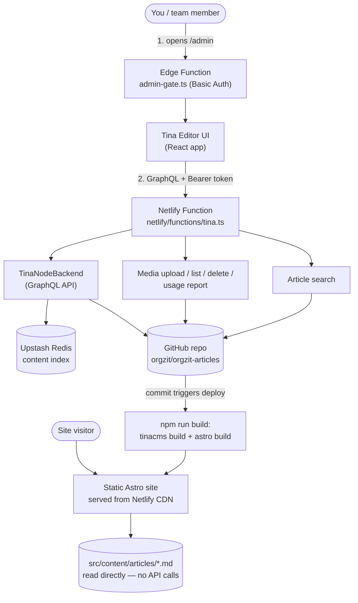

# Orgzit Support Site

The Orgzit support/knowledge-base site (migrated from Intercom) — a static
[Astro](https://astro.build) site with a self-hosted [TinaCMS](https://tina.io)
editor at `/admin`, so non-technical team members can edit articles and
manage images through a web UI without touching code.

**No TinaCloud** — everything Tina normally provides as a paid hosted
service (backend, media storage, search, auth) is self-hosted here using
free/open tools instead: GitHub (content + images), Upstash Redis (content
index), and a single shared password (auth).

## Requirements

**To run this locally (edit content, preview the site):**

- [Node.js](https://nodejs.org) `>=22.12.0` (see `engines` in `package.json`) — includes npm
- Nothing else. Local dev uses `TINA_PUBLIC_IS_LOCAL=true`, which writes
  straight to disk — no GitHub token, no Upstash account, no Netlify
  account needed just to develop.

**To deploy this to production:**

- A [Netlify](https://netlify.com) account, with this repo connected as a site
- Write access to the `orgzit/orgzit-articles` GitHub repo, plus a
  [Personal Access Token](https://github.com/settings/tokens) for it
- A free [Upstash](https://upstash.com) Redis database (URL + REST token)
- The environment variables listed under [Deploying](#deploying) set in
  Netlify's dashboard

## How it works, at a glance

- **The public site is 100% static.** Every page reads article `.md` files
  directly off disk via Astro Content Collections — no database, no API
  calls, no GraphQL involved for visitors.
- **The `/admin` editor is a separate layer bolted on top.** It's a React
  app (built by Tina) that talks to its own backend via GraphQL to load and
  save articles. That backend is a single Netlify Function
  (`netlify/functions/tina.ts`) — not a server you manage, just a function
  Netlify runs on demand.
- **Saving an article in the editor commits a real file** — to GitHub in
  production, or straight to local disk when running locally.
- **Images work the same way**, through a custom media manager that stores
  everything in this same GitHub repo (`public/images/`) — no Cloudinary,
  S3, or other paid media service.

## Architecture



Two independent paths through the same app: **visitors** never touch
anything below the static site — no function calls, no database. **Editors**
go through the password gate, then everything they do flows through the one
Netlify Function into GitHub (the source of truth) and Upstash (just a fast
index of it). Locally, `TINA_PUBLIC_IS_LOCAL=true` swaps GitHub + Upstash for
plain local disk reads/writes — same code paths, no accounts needed.

## Project structure

```
src/
  pages/        Every file here is a real route (Astro file-based routing)
  content/
    articles/   The actual content — one .md file per article
  layouts/      Shared page shells (header, footer, etc.)
  components/   Reusable UI pieces
  styles/       SCSS stylesheets
  lib/          Small shared helpers (category slugs, icon lookups)

tina/           Self-hosted editor config: schema, auth, custom media
                store, custom search client, the Media Usage screen
tina/__generated__/   Auto-generated by Tina — never hand-edit, regenerated
                       every time `tinacms dev`/`tinacms build` runs

netlify/
  functions/        tina.ts — the one serverless function powering
                     everything server-side: Tina's GraphQL API, media
                     upload/list/delete, the Media Usage report, and
                     article search
  edge-functions/    admin-gate.ts — the password gate in front of /admin,
                     independent of the function above

public/
  images/       Every article's images (managed via the Media Manager /
                Media Usage screen inside /admin)
  admin/        The *compiled* Tina editor bundle — generated by
                `tinacms build`, not something you edit directly
  icons/        Site icons (favicon, etc.)
```

`.astro/` and `.netlify/` are local tooling caches — safe to ignore, never
committed meaningfully, regenerated automatically.

## Commands

| Command | What it does |
| :-- | :-- |
| `npm install` | Install dependencies |
| `npm run dev` | Start the site **and** the self-hosted editor locally (`tinacms dev -c "netlify dev"`) at `http://localhost:8888` |
| `npm run build` | Build the editor + the static site to `./dist/` |
| `npm run preview` | Preview the production build locally |

## Local development

```sh
npm install
npm run dev
```

Open `http://localhost:8888` for the site, or `http://localhost:8888/admin`
for the editor. Locally, `TINA_PUBLIC_IS_LOCAL=true` in `.env` makes the
editor write straight to disk instead of GitHub — no GitHub token or
Upstash account needed just to develop.

If a newly-created article doesn't show up on the site right after saving,
it's a known Astro dev-mode quirk (the content watcher occasionally misses
brand-new files) — restart `npm run dev` and it'll pick it up.

## Deploying

Netlify builds and deploys the static site, the function, and the edge
function together as one deploy — there's no separate "deploy the backend"
step. Just push to the connected branch (or `netlify deploy`).

**Before the first production deploy**, set these in Netlify's dashboard
(Site settings → Environment variables — not your local `.env`):

| Variable | Value |
| :-- | :-- |
| `TINA_PUBLIC_IS_LOCAL` | leave unset (local-mode only applies to your machine) |
| `GITHUB_OWNER` | `orgzit` |
| `GITHUB_REPO` | `orgzit-articles` |
| `GITHUB_BRANCH` | `main` |
| `GITHUB_PERSONAL_ACCESS_TOKEN` | a GitHub token with write access to the repo above |
| `UPSTASH_REDIS_REST_URL` / `UPSTASH_REDIS_REST_TOKEN` | from a free database at upstash.com |
| `ADMIN_PASSWORD` | a real password of your choosing (not the local test value) |

### Opening the editor once deployed

1. Visit `https://<your-site>/admin`
2. Your browser shows a native login prompt (the Edge Function gate) —
   username must be exactly `admin`, password = `ADMIN_PASSWORD`
3. Tina's own login screen appears next — same password again (username
   field is ignored there; this is one shared password, not per-user accounts)

## Why Upstash Redis?

Tina's self-hosted backend needs a real database to index content for its
GraphQL API — GitHub alone can't be queried fast enough for that. Upstash
Redis is serverless and free at this scale, which fits a Netlify Functions
deployment better than a long-running database connection would. GitHub
stays the actual source of truth; Upstash is just a fast index of it that
could be rebuilt from GitHub if it were ever lost.

## Cost

Everything here is free, open-source tooling — no subscription to Tina.
The only real infrastructure costs are Netlify hosting and Upstash Redis,
and both have free tiers that comfortably cover a site this size (a fully
static site + light, editor-only backend usage). Check current pricing at
[netlify.com/pricing](https://www.netlify.com/pricing) and
[upstash.com/pricing](https://upstash.com/pricing) before relying on this
long-term.

## Admin features

- **Support Articles** — the article collection. Includes a working search
  box (word-based matching, tolerant of small phrasing differences).
  "New Folder" is disabled here — articles are flat, addressed by their own
  `slug` field, and Tina has no way to delete a folder once created. Every
  field the site's content schema requires (`title`, `slug`, `category`,
  `summary`, `author`, `authorAvatar`, `date`) is also marked `required` in
  Tina's schema, so the Save button is blocked until they're all filled in —
  an incomplete article can't be written to disk, which would otherwise
  crash the entire site build (both local dev and the next production
  deploy), not just that one page.
- **Media Manager** — upload/browse/insert images into articles, stored in
  this repo's `public/images/`.
- **Media Usage** (in the sidebar, below Media Manager) — a custom
  dashboard showing every image, whether it's used in an article and
  which one, with search by folder name and a "Delete folder" option
  (with a confirmation panel listing exactly what would break).

## Security

- **Path containment.** Every media route resolves its final path and
  verifies it stays inside `public/images/` before touching disk or
  GitHub — closes off using `directory`/`filename` traversal (e.g.
  `../../netlify/functions`) to read, overwrite, or delete files anywhere
  else in the repo.
- **Upload validation.** Uploads are checked server-side against an
  extension allowlist (`.jpg/.jpeg/.png/.gif/.webp`) *and* their actual
  file bytes (extensions alone are spoofable), plus a 1MB size cap — not
  just the client-side checks in `tina/media-store.ts`, which are
  bypassable by calling the API directly.
- **Brute-force throttling** on the shared password at both layers: the
  Netlify Function tracks failed attempts per IP in memory, and the
  `/admin` Edge Function uses Netlify's own native, edge-network-distributed
  rate limiting (see the `rateLimit` config in `admin-gate.ts`).
- **No open CORS** — the admin UI and API always share one origin, so
  there's no legitimate cross-origin caller; removed rather than left wide
  open for nothing.
- **Constant-time password comparison** (`crypto.timingSafeEqual`) on the
  API-level auth check, to avoid a timing side-channel.
- **Security headers** site-wide (`X-Frame-Options`, `X-Content-Type-Options`,
  `Referrer-Policy`, `Permissions-Policy`, `Strict-Transport-Security`) in
  `netlify.toml`, plus a **Content-Security-Policy scoped to `/admin` only**,
  built from actually inspecting the compiled Tina bundle rather than
  guessed. Rolled out safely: deployed first as
  `Content-Security-Policy-Report-Only` (logs violations without blocking
  anything), verified clean through a real admin session (login, edit/save
  an article, upload/delete media, Media Usage, search), then switched to
  the real, enforcing header. The CSP itself lives in
  `netlify/edge-functions/admin-gate.ts` rather than a static header rule —
  it's applied conditionally, skipped whenever the request hostname is
  `localhost`/`127.0.0.1`, since `npm run dev` serves a completely different
  Vite dev-mode HTML shell (inline React Refresh scripts, a script loaded
  from its own dev server) that this policy was never meant to cover.
  Currently live and enforced on every real (non-local) deploy.
- Secrets (`GITHUB_PERSONAL_ACCESS_TOKEN`, Upstash credentials,
  `ADMIN_PASSWORD`) are only ever read server-side — confirmed none of them
  reach the compiled browser bundle in `public/admin/`.
